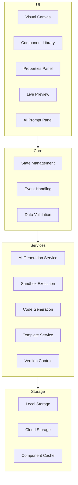

# Design Document

## Overview

The Visual Artifact Studio is architected as a modern React-based application that combines visual component building, AI-powered generation, and real-time preview capabilities. The system follows a modular component architecture with clear separation of concerns between the visual editor, AI services, sandbox execution, and template management.

The application uses a canvas-based approach where users can drag, drop, and manipulate ComponentNode objects that represent UI elements. Each ComponentNode contains metadata about position, size, styling, and properties, enabling both visual editing and code generation.

## Architecture

### High-Level Architecture



### Component Hierarchy

The application follows a hierarchical component structure:

- **ArtifactBuilder** (Root container)
  - **ComponentLibrary** (Left sidebar)
  - **VisualCanvas** (Main editing area)
  - **LivePreview** (Right panel top)
  - **AIPromptPanel** (Right panel middle)
  - **StylePanel** (Right panel bottom)

### Data Flow

1. **Component Creation**: User drags from library or uses AI generation
2. **State Update**: ComponentNode added to canvas state
3. **Visual Rendering**: Canvas re-renders with new component
4. **Code Generation**: Background process generates React code
5. **Live Preview**: Sandbox executes and displays result
6. **Property Editing**: Style panel updates component properties
7. **Persistence**: Changes saved to storage with version control

## Components and Interfaces

### Core Data Models

#### ComponentNode Interface

```typescript
interface ComponentNode {
  id: string; // Unique identifier
  type: ComponentType; // Component category
  props: Record<string, any>; // Component properties
  children?: ComponentNode[]; // Nested components
  position: { x: number; y: number }; // Canvas position
  size: { width: number; height: number }; // Dimensions
  styles: Record<string, string>; // CSS styles
  metadata?: {
    // Additional metadata
    version: string;
    created: Date;
    modified: Date;
    author?: string;
  };
}
```

#### ArtifactTemplate Interface

```typescript
interface ArtifactTemplate {
  id: string;
  name: string;
  description: string;
  category: string;
  preview: string; // Base64 or URL
  code: string; // Generated React code
  components: ComponentNode[]; // Component tree
  tags: string[]; // Search tags
  rating: number; // Community rating
  downloads: number; // Usage statistics
  author: string; // Creator info
  license: string; // Usage license
}
```

### Visual Canvas Component

The VisualCanvas handles the interactive editing experience:

**Key Features:**

- Drag and drop component placement
- Visual selection with handles
- Real-time position and size updates
- Grid snapping and alignment guides
- Multi-selection and group operations
- Undo/redo functionality

**Interaction Patterns:**

- Click to select components
- Drag to move components
- Resize handles for dimension changes
- Context menu for component operations
- Keyboard shortcuts for common actions

### AI Generation Service

The AI service transforms natural language prompts into ComponentNode structures:

**Input Processing:**

- Parse user prompt for intent and requirements
- Extract component types and relationships
- Identify styling and interaction requirements
- Determine appropriate framework patterns

**Generation Pipeline:**

1. **Prompt Analysis**: NLP processing to understand requirements
2. **Component Planning**: Determine component hierarchy and types
3. **Code Generation**: Create React component code
4. **Validation**: Syntax and logic checking
5. **Sandbox Testing**: Execute in isolated environment
6. **Result Packaging**: Return ComponentNode structure

**Example Transformations:**

- "Create a loan calculator" → Calculator component with inputs, sliders, and result display
- "Make a quiz about React" → Quiz component with questions, answers, and scoring
- "Design a pricing table" → Responsive grid with pricing tiers and features

### Sandbox Execution Environment

The sandbox provides safe code execution and preview generation:

**Security Features:**

- Isolated execution context
- Resource limitations (memory, CPU, network)
- Restricted API access
- Timeout protection

**Execution Process:**

1. Receive generated component code
2. Create isolated execution environment
3. Load required dependencies (React, styling libraries)
4. Execute component rendering
5. Capture output and errors
6. Return preview HTML and execution results

### Template Management System

**Template Storage:**

- Local templates stored in browser storage
- Cloud templates synchronized across devices
- Community marketplace with public templates
- Version control for template evolution

**Template Operations:**

- Save current canvas as template
- Load template into canvas
- Share templates with community
- Rate and review community templates
- Search and filter by category/tags

## Data Models

### State Management

The application uses React's built-in state management with the following structure:

```typescript
interface AppState {
  canvas: {
    components: ComponentNode[];
    selectedNodes: string[];
    clipboard: ComponentNode[];
    history: CanvasSnapshot[];
    historyIndex: number;
  };

  ui: {
    activePanel: "library" | "properties" | "ai" | "templates";
    previewMode: "desktop" | "tablet" | "mobile";
    gridVisible: boolean;
    snapToGrid: boolean;
  };

  generation: {
    isGenerating: boolean;
    currentRequest?: AIGenerationRequest;
    generationHistory: GenerationResult[];
  };

  templates: {
    local: ArtifactTemplate[];
    community: ArtifactTemplate[];
    favorites: string[];
    searchQuery: string;
    selectedCategory: string;
  };
}
```

### Component Type System

```typescript
type ComponentType =
  | "container" // Layout containers
  | "text" // Text elements
  | "button" // Interactive buttons
  | "input" // Form inputs
  | "image" // Images and media
  | "chart" // Data visualizations
  | "custom"; // User-defined components

interface ComponentDefinition {
  type: ComponentType;
  name: string;
  icon: string;
  defaultProps: Record<string, any>;
  editableProps: PropertyDefinition[];
  supportedStyles: StyleProperty[];
  canHaveChildren: boolean;
  category: string;
}
```

### Property System

```typescript
interface PropertyDefinition {
  key: string;
  label: string;
  type: "string" | "number" | "boolean" | "color" | "select" | "textarea";
  defaultValue: any;
  options?: string[]; // For select type
  validation?: ValidationRule[];
  description?: string;
}

interface StyleProperty {
  property: string;
  label: string;
  type: "length" | "color" | "select" | "number";
  category: "layout" | "typography" | "appearance" | "spacing";
  responsive: boolean;
}
```

## Error Handling

### Client-Side Error Handling

**Component Errors:**

- Invalid property values → Show validation messages
- Rendering failures → Display error boundaries
- Drag/drop issues → Reset to last valid state

**AI Generation Errors:**

- Network failures → Retry with exponential backoff
- Invalid prompts → Provide suggestions and examples
- Generation timeouts → Cancel and show timeout message
- Malformed responses → Parse and extract valid components

**Sandbox Errors:**

- Execution failures → Display error details and suggestions
- Security violations → Block execution and warn user
- Resource limits → Show performance optimization tips

### Error Recovery Strategies

1. **Graceful Degradation**: Continue operation with reduced functionality
2. **Auto-Save**: Preserve work during errors with periodic saves
3. **Undo System**: Allow users to revert problematic changes
4. **Error Reporting**: Collect anonymized error data for improvements

## Testing Strategy

### Unit Testing

**Component Testing:**

- Test individual React components in isolation
- Mock external dependencies and services
- Verify prop handling and event emission
- Test error states and edge cases

**Service Testing:**

- Test AI generation service with various prompts
- Validate code generation output
- Test sandbox execution with different component types
- Verify template management operations

### Integration Testing

**User Workflow Testing:**

- Complete component creation workflows
- AI generation to canvas integration
- Template save and load operations
- Multi-component interactions

**Cross-Browser Testing:**

- Ensure compatibility across modern browsers
- Test drag and drop functionality
- Verify canvas rendering performance
- Test responsive design breakpoints

### Performance Testing

**Canvas Performance:**

- Test with large numbers of components (100+)
- Measure rendering performance during interactions
- Test memory usage during extended sessions
- Verify smooth animations and transitions

**AI Generation Performance:**

- Measure response times for different prompt types
- Test concurrent generation requests
- Monitor resource usage during generation
- Verify timeout handling

### End-to-End Testing

**Complete User Journeys:**

- New user onboarding flow
- Component creation and customization
- AI-assisted component generation
- Template creation and sharing
- Export and deployment workflows

**Accessibility Testing:**

- Keyboard navigation support
- Screen reader compatibility
- Color contrast compliance
- Focus management during interactions

### Testing Tools and Framework

- **Unit Tests**: Jest + React Testing Library
- **Integration Tests**: Cypress for user workflows
- **Performance Tests**: Lighthouse + custom metrics
- **Visual Regression**: Percy or similar tool
- **Accessibility**: axe-core integration
