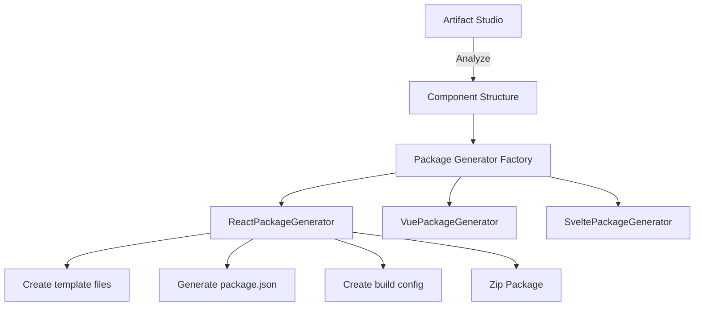

# Phase 6.3 - Export Package Guide

## Analyse de la Structure Actuelle du Système d'Export

### 1. Composants Analysés

#### 📁 `app/components/LivePreview.tsx` - Système d'Aperçu et Export Simple

- **Fonction actuelle** : Export uniquement fichier unique `.tsx`
- **Méthode** : `Blob` + téléchargement direct
- **Limitations** : Pas de structure projet, pas de gestion dépendances

#### 📁 `app/lib/aiCodeGen.ts` - Génération Multi-Framework

- **Support** : React (lines 195-273), Vue (lines 275-351), Svelte (lines 353-425)
- **Architecture** : Classes génération séparées par framework
- **État actuel** : Génération code seulement, pas de structure projet

#### 📁 `app/lib/sandbox.ts` - Exécution Isolée

- **Système** : Communication iframe via postMessage
- **Éléments clés** : `SANDBOX_READY_MESSAGE`, `RENDER_COMPONENT_MESSAGE`, `ERROR_MESSAGE`

### 2. Architecture Étendue pour Phase 6.3



## Plan d'Implémentation

### Phase 1 : Structure de Base

Créer un nouveau service [`app/lib/packageGenerator.ts`](app/lib/packageGenerator.ts:1)

### Phase 2 : Templates de Projet

Créer des templates pour chaque framework dans [`app/lib/projectTemplates/`](app/lib/projectTemplates/:1)

### Phase 3 : UI Étendue

Ajouter options d'export dans [`LivePreview.tsx`](app/components/LivePreview.tsx:109)

## Spécifications Techniques

### 1. Nouvelles Interfaces TypeScript

```typescript
interface ExportOptions {
  type: "component" | "package" | "project";
  framework: "react" | "vue" | "svelte";
  buildTool: "webpack" | "vite" | "rollup";
  includeTests: boolean;
}

interface PackageStructure {
  name: string;
  files: Record<string, string>;
  packageJson: PackageJSON;
  dependencies: string[];
}
```

### 2. Templates Prévus

#### React Package

- Structure : `src/components`, `examples/`, `package.json`, `rollup.config.js`
- Dépendances : `react`, `react-dom`, `@types/react`

#### Vue Package

- Structure : `src/components`, `examples/`, `package.json`, `vite.config.js`
- Dépendances : `vue`, `@vue/compiler-sfc`

#### Svelte Package

- Structure : `src/components`, `examples/`, `package.json`, `svelte.config.js`
- Dépendances : `svelte`

#### Next.js Project

- Structure : `pages/`, `components/`, `package.json`, `tailwind.config.js`
- Dépendances : `next`, `react`, `tailwindcss`

## Étapes d'Implémentation

### 1. Créer [`app/lib/packageGenerator.ts`](app/lib/packageGenerator.ts:1)

```typescript
export class PackageGenerator {
  async generate(options: ExportOptions, code: string): Promise<Blob> {
    switch (options.framework) {
      case "react":
        return this.createReactPackage(code, options);
      case "vue":
        return this.createVuePackage(code, options);
      case "svelte":
        return this.createSveltePackage(code, options);
    }
  }
}
```

### 2. Créer [`app/lib/templates/`](app/lib/templates/:1)

- `react-package.template.ts`
- `vue-package.template.ts`
- `svelte-package.template.ts`
- `nextjs-project.template.ts`

### 3. Étendre [`LivePreview.tsx`](app/components/LivePreview.tsx:109)

Ajouter :

- Dropdown pour type d'export
- Options de configuration
- Progress bar pour téléchargement

## Dépendances Requises

- `jszip` : Compression zip
- `file-saver`: Téléchargement client

## Structure des Packages Générés

### Exemple React Package

```
my-component/
├── package.json
├── README.md
├── src/
│   └── components/
│       └── MyComponent.tsx
├── examples/
│   └── basic.tsx
├── rollup.config.js
└── tsconfig.json
```

Cette extension complète la base existante avec une architecture modulaire qui suit le pattern établi dans `aiCodeGen.ts` et `LivePreview.tsx`.
